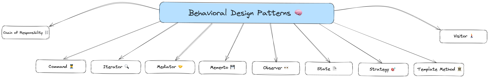
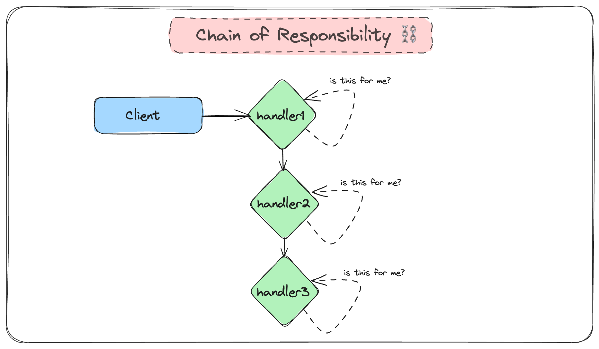
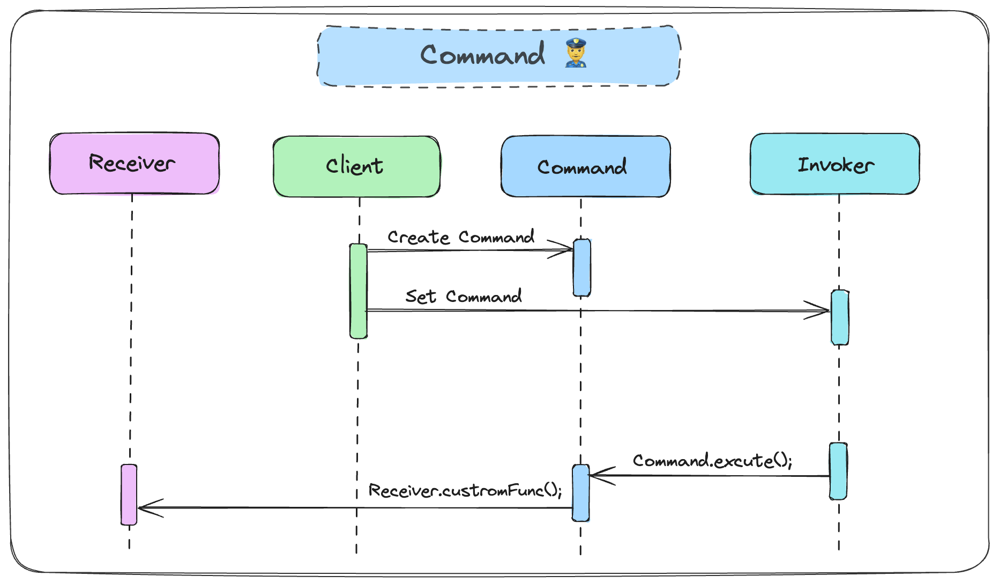
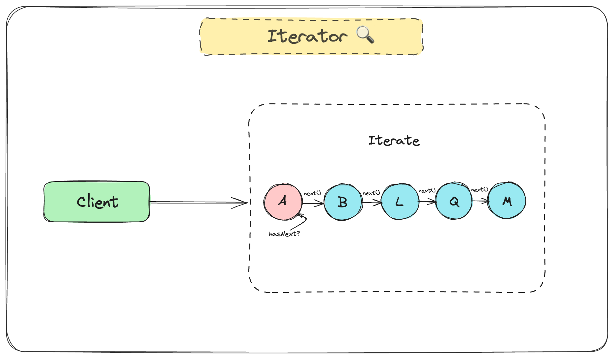
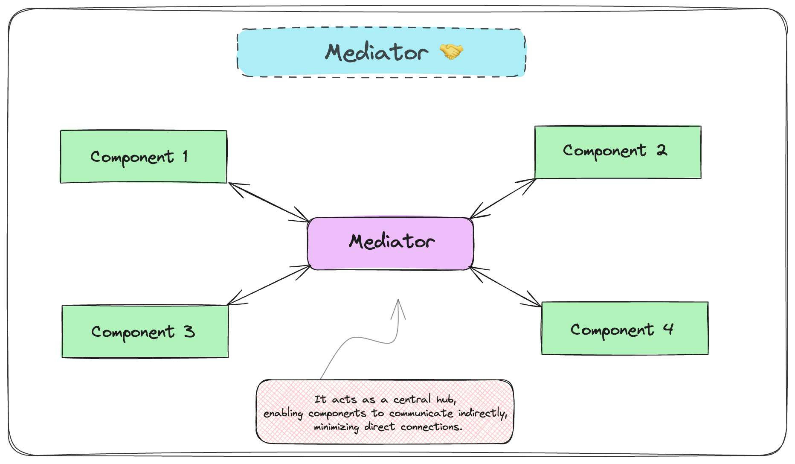
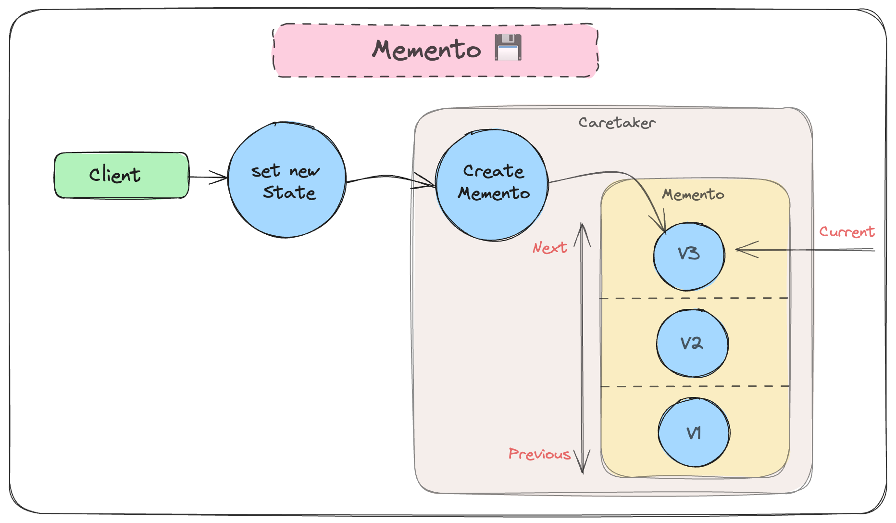
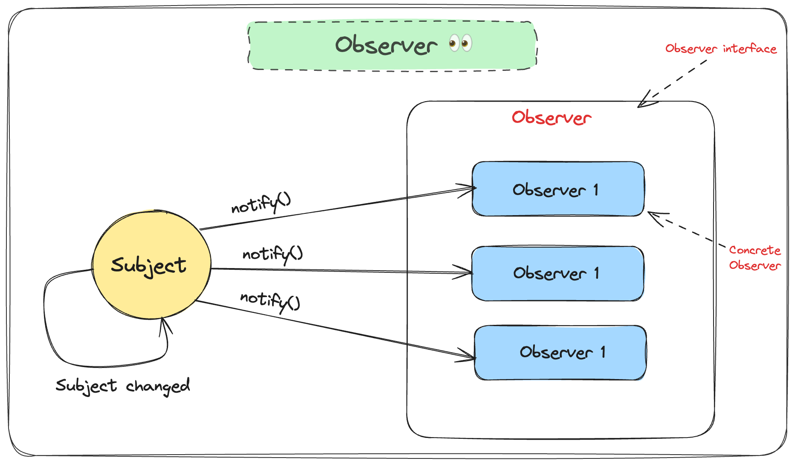
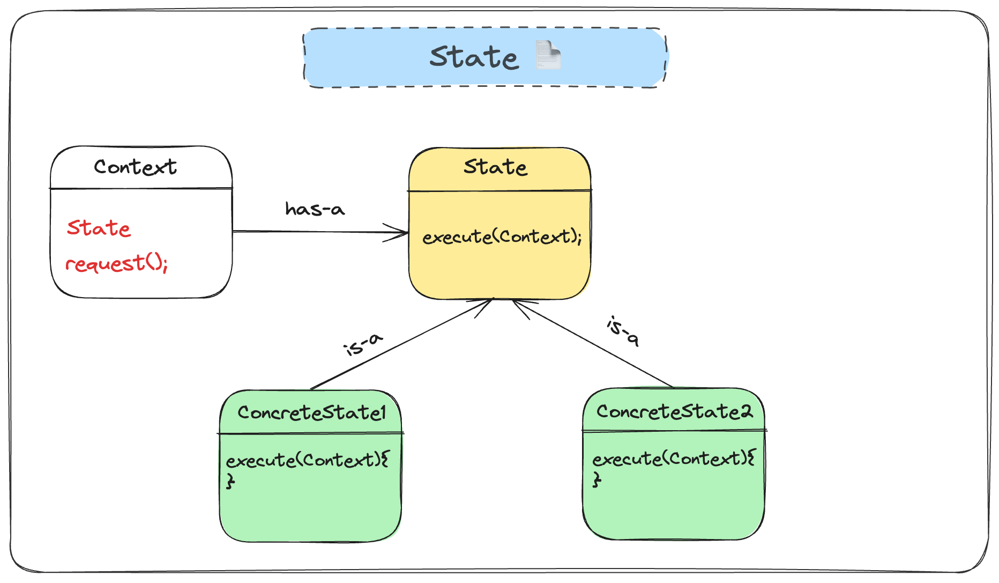
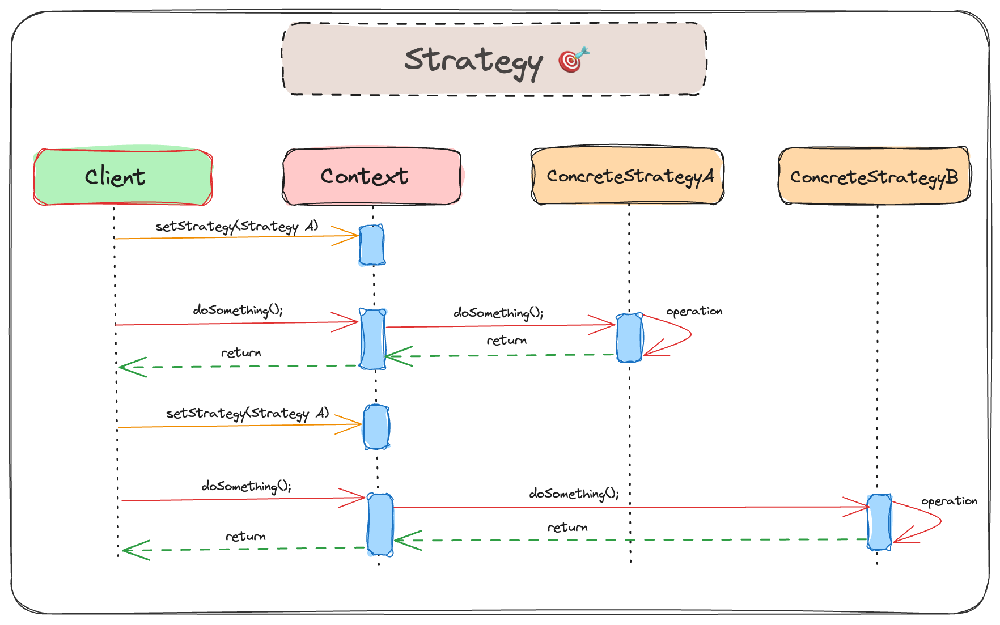
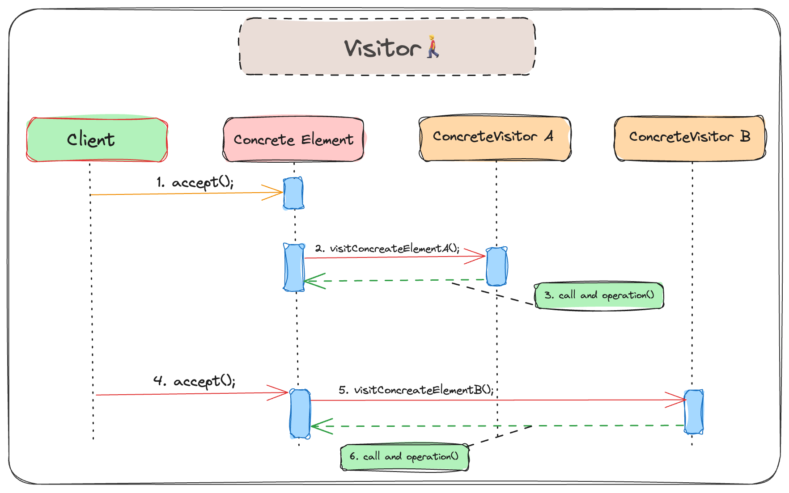

<br>
<p align="center">
  
</p>

<p align="center">
  🔮 Comprehensive Guide to Design Patterns and SOLID Principles in TypeScript 🔮
</p>
<p align="center">
Explore essential concepts in software engineering, such as Design Patterns and SOLID principles, for creating scalable, maintainable, and efficient code. This repo simplifies these ideas, ensuring accessibility for developers of all levels. Let's delve into this world together and unravel the secrets of effective software engineering!
</p>

## What are Design Patterns? 👀
Design patterns are reusable solutions to common problems in software design, offering a structured and proven approach to addressing recurring challenges. They serve as templates or blueprints for solving specific types of problems, making it easier for developers to create efficient and maintainable code. Design patterns provide a shared vocabulary and understanding among developers, promoting reusability, modularity, and improved communication. They encapsulate the best practices of experienced developers, allowing for easier problem-solving and enhanced maintainability. However, it's crucial to apply design patterns judiciously, considering the specific context and potential trade-offs associated with their use.

## Origins and Evolution of Design Patterns 🪄
Imagine building houses. Sometimes, you use similar designs for windows or doors because they work well. The same idea applies to computer programs. Design patterns help us solve common problems in a smart and reusable way.

### Architectural Genesis 🎩
[Christopher Alexander](https://en.wikipedia.org/wiki/Christopher_Alexander), an architect, initially introduced the concept of design patterns in the 1970s through his work "A Pattern Language," where he explored the identification and application of patterns to solve recurring design dilemmas in architecture.

### Transition to Software Development ✨
The adoption and adaptation of this concept for software engineering occurred when a group of computer scientists, often known as the "Gang of Four" (GoF), brought forth the idea. In their influential book "Design Patterns: Elements of Reusable Object-Oriented Software" (1994), Erich Gamma, Richard Helm, Ralph Johnson, and John Vlissides introduced 23 design patterns for object-oriented programming, marking a pivotal moment in the popularization of design patterns within software development.

## Why Do We Use Design Patterns? 🎁
Several compelling reasons drive the utilization of design patterns:
1. **Reusability:** Design patterns offer proven solutions to common problems, reducing the time and effort required to address them from scratch, thereby promoting reusability and modularity in software systems.
2. **Improved Communication:** These patterns establish a shared vocabulary and understanding among developers, facilitating more effective communication about design decisions and solutions.
3. **Best Practices:** Encapsulating the best practices of experienced developers, design patterns provide a learning ground for novices to benefit from their expertise.
4. **Maintainability:** The implementation of design patterns often results in more maintainable code, easing the process of updating, debugging, and extending the codebase in the future.
5. **Easier Problem-Solving:** Design patterns offer a structured approach to problem-solving, aiding developers in breaking down complex issues into more manageable components.

## Things to Remember When Using Design Patterns ⚠️
It's super important to use design patterns wisely. Imagine you have a cool tool, but you shouldn't use it for everything. Here's why:
1. **Think About the Situation:** Design patterns work best in certain situations. Using them blindly might not always be the right choice.
2. **Keep It Simple:** Sometimes, a simple solution is better than a fancy one. Don't make things more complicated than they need to be.
3. **Watch Out for Speed Bumps:** Design patterns can slow down our programs a bit. We need to decide if the benefits are worth it.
4. **Be Ready to Change:** As projects grow, what worked before might not be the best choice anymore. We need to be flexible and adjust.

> Using design patterns is like having a toolbox full of helpful tools. Just remember, not every tool is right for every job. We should pick the ones that fit the situation best. If we do that, our programs will be strong and reliable!

## Getting Started 👻
To get started, follow the navigation below to explore different sections of this repository:
- [Design Patterns](#design-patterns-): Reusable solutions to common problems in software design.
- [SOLID Principles](#solid-principles-): Guiding principles for creating well-structured and maintainable code.

Feel free to dive into the content that interests you the most!

# Design Patterns 🔮
Design patterns are reusable solutions to common problems that occur in software design. They can be classified into three main categories: Creational, Structural, and Behavioral design patterns. Each of these categories serves a distinct purpose and helps in solving different types of problems in software design.
1. [Creational Design Patterns 🏗](#creational-design-patterns-)
   - [Singleton 💍](#singleton-)
   - [Prototype 🧬](#prototype-)
   - [Builder 👷](#builder-)
   - [Factory Method 🏭](#factory-method-)
   - [Abstract Factory 🔨](#abstract-factory-)
3. [Structural Design Patterns 🛠️](#structural-design-patterns-)
   - [Adapter 🔌](#adapter-)
   - [Bridge 🌉](#bridge-)
   - [Composite 🌴](#composite-)
   - [Decorator 🎨](#decorator-)
   - [Facade 🏰](#facade-)
   - [Flyweight 🪰](#flyweight-)
   - [Proxy 🔗](#proxy-)
5. [Behavioral Design Patterns 🧠](#behavioral-design-patterns-)
   - [Chain of Responsibility ⛓️](#chain-of-responsibility-)
   - [Command 👮‍♂️](#command-)
   - [Iterator 🔍](#iterator-)
   - [Mediator 🤝](#mediator-)
   - [Memento 💾](#memento-)
   - [Observer 👀](#observer-)
   - [State 📄](#state-)
   - [Strategy 🎯](#strategy-)
   - [Template Method 🏛️](#template-method-)
   - [Visitor 🚶‍♂️](#visitor-)

# Creational Design Patterns 🏗
Creational design patterns 🎨 revolve around the intricacies of object creation. They introduce a level of abstraction to the instantiation process, ensuring the system remains agnostic to the specifics of how its objects come into existence, are composed, and represented. These design patterns offer a mechanism for object creation that conceals the intricacies of the creation logic, steering away from direct object instantiation using the new operator. By doing so, they grant greater flexibility in determining the objects necessary for a given use case. Notable examples of creational design patterns encompass Singleton, Factory Method, Abstract Factory, Builder, and Prototype. 🚀


<br/>
<hr/>

## Singleton 💍
> The Singleton pattern is a creational design pattern ensuring that a class has only one instance while providing global access to this instance.

In simple words: 
> "Singleton - ensures that only one object of a particular class is ever created."


### Steps of Implementation
Implementing the Singleton pattern in object-oriented programming typically involves the following steps:

1. Declare a private ```static``` attribute in the singleton class.
2. Create a public static method (commonly named ```getInstance()```) to serve as a global access point for the singleton object. This method embraces "lazy initialization," meaning it generates a new instance only when necessary.
3. Set the constructor of the singleton class as ```private```, preventing external objects from using the ```new``` operator with the singleton class.
4. Within the static method of the class, verify the existence of the singleton instance. If it exists, return it; otherwise, create a new instance and return it.

### Classic Implementation:
Here is how we might create a database connection using the Singleton pattern:
```ts
class Database {
  // Step 1: Declare a private static instance
  private static instance: Database;

  // Step 3: Make the constructor private
  private constructor() {}

  // Step 2: Create a public static getInstance method
  public static getInstance(): Database {
    if (!Database.instance) {
      Database.instance = new Database();
    }
    return Database.instance;
  }

  public query(query: string): void {
    console.log(`Executing query '${query}' on database.`);
  }
}

// Usage
const db1 = Database.getInstance();
const db2 = Database.getInstance();

db1.query("SELECT * FROM users"); // Executing query `SELECT * FROM users` on database.
db2.query("DROP DATABASE users"); // Executing query `DROP DATABASE users` on database.

console.log(db1 === db2); // true
```

In this example, the ```Database``` class represents a database connection. The getInstance method ensures that there is only one instance of the Database class, and the query method allows you to perform queries on the database. 
The usage demonstrates that ```db1``` and ```db2``` are the same instance, showcasing the Singleton pattern behavior. 

### When To Use Singleton Pattern ? ✅
Consider using Singleton when:
- You have global variables that should be accessible universally.
- There is repeated, expensive initialization of the same resource.
- Multiple parts of your system access and potentially modify a shared resource.
- An entity is accessed inconsistently across the system.
- Duplicate instances are generated, and identical instances are unnecessary.
- Excessive parameters are passed through layers for an object.

### Disadvantages of Singleton Pattern 🆘 :
Despite its advantages, the Singleton pattern has drawbacks:

- **Violates Single Responsibility Principle 🚫:**
Simultaneously managing object instantiation and global access might breach the Single Responsibility Principle.

- **Masking Design Issues 🎭:**
Singleton can hide underlying design problems, offering a quick fix without addressing the root causes.

- **Multithreading Challenges  🔄:**
Implementing Singleton in a multithreaded environment requires careful synchronization to prevent unintended multiple instantiations.

- **Unit Testing Complexity 🧪:**
Unit testing client code using Singleton can be complex due to private constructors and challenges in mocking the singleton instance.


## Prototype 🧬
Prototype is a creational design pattern that lets you copy existing objects without making your code dependent on their classes. It allows you to create a copy of an existing object and modify it to your needs, instead of going through the trouble of creating an object from scratch and setting it up.

In simple words:
> Create a new object based on an existing object through **cloning**.


### Implementation: 
Let's see a simple implementation of the Prototype pattern in TS through an example in game development.
```ts
interface Prototype {
    clone(): Prototype;
    details: EnemyDetails;
}

interface EnemyDetails {
    type: string;
    strength: number;
}

/**
 * Concrete Prototype representing an Enemy in a Game
 */
class Enemy implements Prototype {
    constructor(public details: EnemyDetails) {}

    public clone(): Enemy {
        const clone = new Enemy({ ...this.details });
        return clone;
    }
}

// Usage
const originalEnemy: Prototype = new Enemy({ type: "Dragon", strength: 10 });
const clonedEnemy: Prototype = originalEnemy.clone();

console.log(originalEnemy.details); // { type: 'Dragon', strength: 10 }
console.log(clonedEnemy.details); // { type: 'Dragon', strength: 10 }

clonedEnemy.details = { type: 'Goblin', strength: 8 };
console.log(clonedEnemy.details); // { type: 'Goblin', strength: 8 }
```
This approach enhances code efficiency and maintainability, allowing easy modification of specific properties without creating new instances for each enemy.

### When to Use the Prototype Pattern ? ✅
The Prototype pattern is handy when copying existing objects is more efficient than creating new ones. It's beneficial for systems seeking independence in creating, composing, and representing products.
- Clone prototypes to avoid redoing intricate constructions for similar objects.
- Clone pre-loaded objects to enhance efficiency when creating from scratch is resource-intensive.
- Use the Prototype pattern when needing multiple similar but not identical objects.
- Facilitates storing and cloning prototypes for restoring previous states, ideal for undo features.

### Advantages of the Prototype Pattern 🪄 : 
- Avoiding Object Reference Errors 🚫
- Efficient Object Cloning 🚀
- Simplifying Object Creation 🌐

### Disadvantages of the Prototype Pattern 🆘 : 
- Shallow vs. Deep Copying 🔄 : Cloning complex objects that have circular references might be very tricky
- Complex Cloning Hierarchies 📜: Cloning hierarchical structures introduces complexities, particularly with interconnected objects and relationships.

## Builder 👷
Builder is a creational design pattern facilitating the step-by-step construction of complex objects. It enables the creation of various object types using a unified construction process, preventing constructor overload. _Use the Builder pattern to get rid of a “telescoping constructor”._

In simple words:
> Builder helps in creating different versions of an object without cluttering the constructor.


### Implementation Example in TypeScript:
```ts
interface IPizza {
    name: string;
    size: string;
    isCheese: boolean;
}

interface IPizzaBuilder {
    setName(name: string): IPizzaBuilder;
    setSize(size: string): IPizzaBuilder;
    setCheese(isCheese: boolean): IPizzaBuilder;
    build(): IPizza;
}

class Pizza implements IPizza {
    constructor(
        public name: string,
        public size: string,
        public isCheese: boolean
    ) { }
}

class PizzaBuilder implements IPizzaBuilder {
    private name: string = "";
    private size: string = "";
    private isCheese: boolean = false;

    setName(name: string): IPizzaBuilder {
        this.name = name;
        return this;
    }

    setSize(size: string): IPizzaBuilder {
        this.size = size;
        return this;
    }

    setCheese(isCheese: boolean): IPizzaBuilder {
        this.isCheese = isCheese;
        return this;
    }

    build(): IPizza {
        return new Pizza(this.name, this.size, this.isCheese);
    }
}

class PizzaDirector {
    constructor(private builder: IPizzaBuilder) { }

    public buildMinimalPizza(name: string, size: string): IPizza {
        return this.builder
            .setName(name)
            .setSize(size)
            .build();
    }

    public buildFullFeaturedPizza(name: string, size: string, isCheese: boolean): IPizza {
        return this.builder
            .setName(name)
            .setSize(size)
            .setCheese(isCheese)
            .build();
    }
}

// Usage:
const builder: IPizzaBuilder = new PizzaBuilder();
const director: PizzaDirector = new PizzaDirector(builder);
const pizzaWithoutCheese: IPizza = director.buildMinimalPizza('Pepperoni', 'Medium');
const pizzaWithCheese: IPizza = director.buildFullFeaturedPizza('Hawaiian', 'Small', true);

console.log(pizzaWithoutCheese); // Pizza: { name: 'Pepperoni', size: 'Medium', isCheese: false} 
console.log(pizzaWithCheese); // Pizza: { name: 'Hawaiian', size :'Small', isCheese: true} 
```
This TypeScript code implements a simplified Builder pattern for creating pizza objects, allowing customization of attributes like name, size, and the presence of cheese.

### When to Use Builder Pattern ? ✅
- **Complex Object Creation 🧩:** Simplify the creation of objects with numerous optional and mandatory attributes.
- **Step-by-step Object Creation 🔨:** Useful when an object needs to be built in multiple ordered steps.
- **Immutable Objects 🔄:** Construct immutable objects with many attributes, enhancing object integrity.
- **Code Clarity 📝:** Enhance code readability, especially when dealing with constructors with numerous parameters.

### Advantages of Builder Pattern 🪄 :
- **Fluent Interface 🌐:** Enhances code readability for step-by-step object construction.
- **Separation of Construction Logic and Business Logic 🧠:** Keeps client code focused on business logic by isolating object construction details.
- **Different Representations 🎨:** Utilizes diverse builders for various object representations without modifying client code.
- **Increased Object Integrity 🔒:** Ensures object validity at each step, elevating data integrity.
- **Immutability 🔄:** Returns immutable objects for simplicity, safety, and cleaner code.

### Disadvantages of Builder Pattern 🆘 :
- **Increased Complexity 📈📉:** Introduces abstraction layers, potentially complicating code for those unfamiliar with the pattern.
- **Additional Code 📄:** May result in more code, especially for smaller classes, potentially increasing codebase size.
- **Runtime Errors 🚫:** Lack of compile-time checks may lead to runtime errors if required fields are not set.
- **Refactoring Difficulties 🛠️:** Alters to the class structure might necessitate updates to the builder code, making refactoring more challenging and time-consuming.

## Factory Method 🏭
The Factory Method Pattern is a creational design pattern that provides an interface for creating objects in a superclass, allowing subclasses to alter the type of objects created.

In Simple Terms:
> It enables the delegation of object instantiation to child classes, offering a way to create objects without specifying their exact classes.


### Implementation:
Consider a car manufacturing program with different car types (Sedan, Hatchback): 
```ts
abstract class Car {
  constructor(public model: string, public productionYear: number) {}

  abstract displayCarInfo(): void;
}

class Sedan extends Car {
  displayCarInfo() {
    console.log(`This is a Sedan. Model: ${this.model}, Production Year: ${this.productionYear}`);
  }
}

class Hatchback extends Car {
  displayCarInfo() {
    console.log(`This is a Hatchback. Model: ${this.model}, Production Year: ${this.productionYear}`);
  }
}

class CarFactory {
  public createCar(type: string, model: string, productionYear: number): Car {
    switch (type) {
      case "Sedan":
        return new Sedan(model, productionYear);
      case "Hatchback":
        return new Hatchback(model, productionYear);
      default:
        throw new Error("Invalid car type");
    }
  }
}

// Usage:
const carFactory = new CarFactory();

const sedan = carFactory.createCar("Sedan", "Camry", 2023);
sedan.displayCarInfo(); // This is a Sedan. Model: Camry, Production Year: 2023

const hatchback = carFactory.createCar("Hatchback", "Corolla", 2019);
hatchback.displayCarInfo(); // // This is a Sedan. Model: Corolla, Production Year: 2019
```

### When To Use Factory Pattern ? ✅
- **Uncertain Object Types:** If your software is meant to create different objects at runtime.
- **Similar Classes:** When dealing with numerous classes sharing a common superclass.
- **Pluggability and Flexibility:** Providing users with a way to extend a library with their own classes.

### Advantages Of The Factory Pattern 🪄 :
- **Decoupling 🚀:** Reduces coupling between client code and concrete classes, enhancing maintainability.
- **Flexibility 🤸:** Allows easy addition of new object types without modifying existing client code.
- **Encapsulation 🧳:** Encapsulates object creation details, making the factory responsible for instantiation.

### Disadvantages of Factory Pattern 🆘 :
- **Refactoring 🔄:** Introducing the Factory Pattern to an existing codebase might pose challenges during refactoring.
- **Increased Number of Classes 📈:** The pattern can lead to a higher number of classes, potentially making the codebase more complex.
- **Testing 🧪:** While aiding in writing testable code, complex factories can complicate the testing process, requiring additional setup.


## Abstract Factory 🔨
The Abstract Factory pattern is a creational design pattern that furnishes an interface for constructing families of objects that are related or dependent, all without explicitly specifying their concrete classes.

In Simple Terms:
> A factory of factories.


### Classical Implementation:
```ts
interface Button {
    render(): void;
    onClick(f: Function): void;
}

interface Checkbox {
    render(): void;
    toggle(): void;
}

interface GUIFactory {
    createButton(): Button;
    createCheckbox(button: Button): Checkbox;
}

class WindowsButton implements Button {
    render() {
        console.log("Render a button in Windows style");
    }

    onClick(f: Function) {
        console.log("Bind a Windows style button click event");
        f();
    }
}

class WindowsCheckbox implements Checkbox {
    private button: Button;

    constructor(button: Button) {
        this.button = button;
    }

    render() {
        console.log("Render a checkbox in Windows style");
    }

    toggle() {
        this.button.onClick(() => console.log("Checkbox state toggled!"));
    }
}

class MacOSButton implements Button {
    render() {
        console.log("Render a button in MacOS style");
    }

    onClick(f: Function) {
        console.log("Bind a MacOS style button click event");
        f();
    }
}

class MacOSCheckbox implements Checkbox {
    private button: Button;

    constructor(button: Button) {
        this.button = button;
    }

    render() {
        console.log("Render a checkbox in MacOS style");
    }

    toggle() {
        this.button.onClick(() => console.log("Checkbox state toggled!"));
    }
}

class WindowsFactory implements GUIFactory {
    createButton(): Button {
        return new WindowsButton();
    }

    createCheckbox(button: Button): Checkbox {
        return new WindowsCheckbox(button);
    }
}

class MacOSFactory implements GUIFactory {
    createButton(): Button {
        return new MacOSButton();
    }

    createCheckbox(button: Button): Checkbox {
        return new MacOSCheckbox(button);
    }
}

function renderUI(factory: GUIFactory) {
    const button = factory.createButton();
    const checkbox = factory.createCheckbox(button);

    button.render();
    checkbox.render();

    button.onClick(() => console.log("Button clicked!"));
    checkbox.toggle();
}

console.log("App: Launched with the Windows factory.");
renderUI(new WindowsFactory());

console.log("App: Launched with the MacOS factory.");
renderUI(new MacOSFactory());
```

### When To Use Abstract Factory Pattern ? ✅
- **Interrelated Dependencies:** Ensure that a client uses objects that belong together in a family.
- **Switching Product Families:** Easily swap entire families of objects (e.g., different look-and-feel standards).
- **Supporting Multiple Architectures:** Run software in different environments requiring different implementations of related objects.

### Advantages of Abstract Factory Pattern 🪄 :
- **Consistency among products 🤝:** Ensure compatibility and belongingness within a family of products.
- **Code Reusability 🔄:** Promote reuse of code for creating related product families.
- **Single Responsibility Principle 🎯:** Each concrete factory has a single responsibility, leading to cleaner and more understandable code.

### Disadvantages of Abstract Factory Pattern 🆘 :
- **Complexity 📈:** Introduces complexity and abstraction into the code, which may be unnecessary for simpler applications.
- **Tight Coupling And Dependency 🔗:** Client code becomes dependent on the Abstract Factory interface, requiring changes if the interface changes.
- **Limited Flexibility In Modifying Product Families 🚫:** Adding new types of products may require changing the core factory interface, violating the Open/Closed Principle.


# Structural Design Patterns 🛠
Structural design patterns are a type of design pattern that deal with object composition and the structure of classes/objects. They help ensure that when a change is made in one part of a system, it doesn't require changes in other parts. This makes the system more flexible and easier to maintain.


<br/>
<hr/>

## Adapter 🔌
The Adapter Design Pattern is a software design pattern that allows the interface of an existing class to be used from another interface. It's often used to make existing classes work with others without modifying their source code. The Adapter Pattern is especially useful when the classes that need to communicate with each other do not have compatible interfaces.

In simple words:
> Adapter allows objects with incompatible interfaces to collaborate.


### Classical Implementation:
```ts
// Duck class
class Duck {
  quack(): void {
    console.log("Quack, quack!");
  }

  fly(): void {
    console.log("I'm flying!");
  }
}

// Animal interface
interface Animal {
  makeSound(): void;
  move(): void;
}

// DuckAdapter class
class DuckAdapter implements Animal {
  private duck: Duck;

  constructor(duck: Duck) {
    this.duck = duck;
  }

  makeSound(): void {
    this.duck.quack();
  }

  move(): void {
    this.duck.fly();
  }
}

// Using the Duck and DuckAdapter
const duck = new Duck();
const adapter = new DuckAdapter(duck);

// Now, the duck can be used as an animal
adapter.makeSound(); // Output: Quack, quack!
adapter.move();      // Output: I'm flying!
```
### When To Use Adapter Pattern ? ✅
- **Incompatibility of Interfaces:** Use when different parts can't communicate due to different interfaces.
- **Alternatives to Multiple Inheritance:** In languages without it, Adapter helps inherit behavior from multiple sources.
- **Abstracting Volatile Classes:** Shields the app from changes in frequently changing classes.

### Advantages of Adapter Pattern 🪄 :
- **Reusability and Flexibility:** Reuse existing code without major changes.
- **Decoupling:** Reduces dependencies for easier maintenance.
- **Interoperability:** Enables different parts to work together despite interface mismatches.

### Disadvantages of Adapter Pattern 🆘 :
- **Overuse or Unnecessary Use:** Be cautious to avoid unnecessary complexity.
- **Performance Overhead:** Involves some indirection; may impact performance in critical systems.
- **Potential for Confusion:** Clear documentation needed for developers unfamiliar with the codebase.

## Bridge 🌉
The Bridge pattern is a structural design pattern that lets you split a large class or a set of closely related classes into two separate hierarchies—abstraction and implementation—which can be developed independently of each other.

In simple words:
> It's like a bridge between abstraction and implementation, enabling independent changes for flexibility.


### Let's implement:
1. Implementor interface and concrete implementors:
```ts
interface Database {
  connect(): void;
  query(sql: string): any;
  close(): void;
}

class PostgreSQLDatabase implements Database {
  connect(): void {
    console.log("Connecting to PostgreSQL database.");
  }

  query(sql: string): any {
    console.log(`Executing query '${sql}' on PostgreSQL database.`);
  }

  close(): void {
    console.log("Closing connection to PostgreSQL database.");
  }
}

class MongoDBDatabase implements Database {
  connect(): void {
    console.log("Connecting to MongoDB database.");
  }

  query(sql: string): any {
    console.log(`Executing query '${sql}' on MongoDB database.`);
  }

  close(): void {
    console.log("Closing connection to MongoDB database.");
  }
}
```
2. Abstraction and refined abstractions:
```ts
abstract class DatabaseService {
  protected database: Database;

  constructor(database: Database) {
    this.database = database;
  }

  abstract fetchData(query: string): any;
}

class ClientDatabaseService extends DatabaseService {
  fetchData(query: string): any {
    this.database.connect();
    const result = this.database.query(query);
    this.database.close();
    return result;
  }
}
```
3. Client code:
```ts
let databaseService = new ClientDatabaseService(new PostgreSQLDatabase());
databaseService.fetchData("SELECT * FROM users;"); // use PostgreSQL database

databaseService = new ClientDatabaseService(new MongoDBDatabase());
databaseService.fetchData("db.users.find({})"); // use MongoDB database
```
> In this example, we've created a "bridge" that decouples the high-level DatabaseService class from the specifics of the various Database implementations. By doing this, you can add a new type of database to the application without changing the DatabaseService class or the client code. Also, at runtime, the client can decide which database to use.

### When To Use Bridge Pattern ? ✅
- **Hide Implementation Details:** Expose only necessary client methods for cleaner code.
- **Implementation-Specific Behavior:** Enable different platform implementations without altering client code.
- Prevent Monolithic Designs:** Promote modularity to avoid widespread implications of changes.

### Advantages of Bridge Pattern 🪄 :
- **Decoupling 🧩:** Separates abstraction and implementation for independent evolution.
- **Improved Readability 📚:** Enhances code readability and maintainability.
- **Runtime Binding 🔄:** Allows changing implementations at runtime.

### Disadvantages of Bridge Pattern 🆘 :
- **Over-engineering 🛠️:** Adds complexity if abstraction and implementation are stable.
- **Design Difficulty 🤔:** Choosing the right abstraction can be challenging.
- **Development and Maintenance Costs 💸:** Introducing the Bridge pattern requires refactoring, increasing complexity.


## Composite 🌴
The Composite pattern is a structural design pattern that lets you compose objects into tree-like structures and then work with these structures as if they were individual objects.

In simple words:
> It lets clients treat the individual objects in a uniform manner.


## Implementation in TS:
```ts
// Component
interface Employee {
  getName(): string;
  getSalary(): number;
  getRole(): string;
}

// Leaf
class Developer implements Employee {
  constructor(private name: string, private salary: number) {}

  getName(): string {
    return this.name;
  }

  getSalary(): number {
    return this.salary;
  }

  getRole(): string {
    return "Developer";
  }
}

// Another Leaf
class Designer implements Employee {
  constructor(private name: string, private salary: number) {}

  getName(): string {
    return this.name;
  }

  getSalary(): number {
    return this.salary;
  }

  getRole(): string {
    return "Designer";
  }
}

// Composite
interface CompositeEmployee extends Employee {
  addEmployee(employee: Employee): void;
  removeEmployee(employee: Employee): void;
  getEmployees(): Employee[];
}

class Manager implements CompositeEmployee {
  private employees: Employee[] = [];

  constructor(private name: string, private salary: number) {}

  getName(): string {
    return this.name;
  }

  getSalary(): number {
    return this.salary;
  }

  getRole(): string {
    return "Manager";
  }

  addEmployee(employee: Employee) {
    this.employees.push(employee);
  }

  removeEmployee(employee: Employee) {
    const index = this.employees.indexOf(employee);
    if (index !== -1) {
      this.employees.splice(index, 1);
    }
  }

  getEmployees(): Employee[] {
    return this.employees;
  }
}
```
Here's how you could use these classes:
```ts
const dev1 = new Developer("John Doe", 12000);
const dev2 = new Developer("Karl Durden", 15000);
const designer = new Designer("Mark", 10000);

const manager = new Manager("Michael", 25000);
manager.addEmployee(dev1);
manager.addEmployee(dev2);
manager.addEmployee(designer);

console.log(manager); // { name : "Michael", salary: 25000, employees: [ { name: "John Doe", salary: 12000 } ...] } 
```

### When To Use Composite Pattern ? ✅
- **Tree-like Object Structure:** Useful when objects form a tree-like pattern, such as organizational structures in companies.
- **Part-Whole Hierarchies:** Natural choice for part-whole hierarchies, treating parts and wholes the same way.
- **Uniform Treatment by Clients:** Clients treat all objects uniformly within the composite structure, simplifying client code.

### Advantages of Composite Pattern 🪄 :
- **Simplifies Client Code 🎯:** Uniform treatment of objects simplifies client code.
- **Easily Adds New Components 🌱:** New leaf or composite objects can be added effortlessly by implementing the component interface.
- **Hierarchical Representation 🏰:** Natural fit for systems with hierarchical structures.

### Disadvantages of Composite Pattern 🆘 :
- **SRP Violation 🚧:** May violate the Single Responsibility Principle (SRP).
- **Challenges with Common Interface 🤹‍♂️:** Providing a common interface for classes with vastly different functionalities can be difficult.
- **Indirect Coupling 🔄:** Changes in one object can indirectly affect another, even if not directly linked.


## Decorator 🎨
The Decorator design pattern is a structural design pattern that allows you to dynamically add or override behaviour in an existing object without changing its implementation. This pattern is particularly useful when you want to modify the behavior of an object without affecting other objects of the same class.

In simple words:
> Dynamically enhances object behavior.


## Implementation in TS:
```ts
// Component
interface Coffee {
  cost(): number;
  description(): string;
}

// ConcreteComponent
class SimpleCoffee implements Coffee {
  cost() {
    return 10;
  }

  description() {
    return "Simple coffee";
  }
}

// Decorator
abstract class CoffeeDecorator implements Coffee {
  protected coffee: Coffee;

  constructor(coffee: Coffee) {
    this.coffee = coffee;
  }

  abstract cost(): number;
  abstract description(): string;
}

// ConcreteDecorator
class MilkDecorator extends CoffeeDecorator {
  constructor(coffee: Coffee) {
    super(coffee);
  }

  cost() {
    return this.coffee.cost() + 2;
  }

  description() {
    return `${this.coffee.description()}, with milk`;
  }
}

// Usage
const plainCoffee = new SimpleCoffee();
console.log("Plain Coffee Cost: $" + plainCoffee.cost()); // Plain Coffee Cost: $10
console.log("Description: " + plainCoffee.description()); // Description: Simple coffee

const coffeeWithMilk = new MilkDecorator(plainCoffee);
console.log("Coffee with Milk Cost: $" + coffeeWithMilk.cost()); // Coffee with Milk Cost: $12
console.log("Description: " + coffeeWithMilk.description()); // Description: Simple coffee, with milk

```

### When To Use Decorator Pattern ? ✅
- **Add Responsibilities Dynamically:** When adding responsibilities to objects without affecting others, such as adding formatting options to a text editor.
- **Dynamic Addition and Removal:** For adding and removing responsibilities from an object at runtime.
- **Easily Extend the System:** For future extension, allowing the system to be easily extended with new decorator classes.

### Advantages of Decorator Pattern 🪄 :
- **Flexible Alternative to Subclassing 🔄:** Adds new behaviors to objects without affecting other objects of the same class. 
- **Runtime Addition and Removal 🕰️:** Decorators can be added to and removed from an object dynamically at runtime. 
- **Code Reuse and Reduction 🔄:** Encapsulates specific features in decorator classes, promoting code reuse and reducing redundancy. 

### Disadvantages of Decorator Pattern 🆘 :
- **Many Small Objects 🧩:** Can lead to situations with many small objects, complicating the design and debugging. 
- **Difficult Removal of Specific Wrapper 🔄:** It's challenging to remove a specific wrapper from the wrappers stack. 
- **Complex Initial Configuration 🤯:** Initial configuration code of layers might look ugly in complex systems with many decorators. 

## Facade 🏰

In simple words:
> It provides a simplified interface to a complex subsystem.


## Implementation in TS:
```ts
// Subsystem 1
class AudioPlayer {
  play(): string {
    return "Playing audio";
  }
}

// Subsystem 2
class VideoPlayer {
  play(): string {
    return "Playing video";
  }
}

// Subsystem 3
class Projector {
  display(): string {
    return "Projector displaying content";
  }
}

// Facade
class MultimediaFacade {
  private audioPlayer: AudioPlayer;
  private videoPlayer: VideoPlayer;
  private projector: Projector;

  constructor(audioPlayer: AudioPlayer, videoPlayer: VideoPlayer, projector: Projector) {
    this.audioPlayer = audioPlayer;
    this.videoPlayer = videoPlayer;
    this.projector = projector;
  }

  startMovie(): string {
    const audio = this.audioPlayer.play();
    const video = this.videoPlayer.play();
    const display = this.projector.display();

    return `${audio}\n${video}\n${display}`;
  }

  stopMovie(): string {
    return "Stopping multimedia playback";
  }
}

// Example usage
const audioPlayer = new AudioPlayer();
const videoPlayer = new VideoPlayer();
const projector = new Projector();

const multimediaFacade = new MultimediaFacade(audioPlayer, videoPlayer, projector);

console.log(multimediaFacade.startMovie()); // Playing audio, Playing video, Projector displaying content
console.log(multimediaFacade.stopMovie()); // Stopping multimedia playback
```

### When To Use Facade Pattern ? ✅
- **Rampant Dependencies:** Reduces high coupling by providing a unified interface.
- **Overwhelming Complexity:** Wraps complex subsystems for a straightforward interaction.
- **Simplified API Need:** For libraries or APIs, offers only essential functionalities.

### Advantages of Facade Pattern 🪄 :
- **Simplified Interface 🛡️:** Shields users from subsystem complexities.
- **Reduced Dependencies 🤝:** Minimizes client code dependencies on subsystems.
- **Decoupling 🔗:** Changes in subsystems minimally impact clients.
- **Ease of Use 👤:** Abstracts complexities, making subsystems user-friendly.

### Disadvantages of Facade Pattern 🆘 :
- **Over-abstraction 🤯:** May introduce unnecessary complexity for simple subsystems.
- **Limited Flexibility 🚫:** Restricts access to full subsystem functionality.
- **Hiding Information 🕵️‍♂️:** May conceal crucial details useful in specific scenarios.

## Flyweight 🪰
The Flyweight design pattern is a structural pattern that aims to minimize memory usage or computational expenses by sharing as much as possible with related objects; it provides a way to use objects in large numbers more efficiently. The pattern achieves this by sharing common portions of the object's state among multiple instances, rather than each instance holding its own copy.

In simple words:
> Flyweight pattern is like having a shared pool of objects, where common features are stored centrally, allowing multiple instances to reuse and reference them. This significantly reduces the memory footprint and improves performance.


## Implementation in TS:
```ts
// Flyweight interface
interface TextStyle {
  applyStyle(): void;
}

// Concrete Flyweight
class SharedTextStyle implements TextStyle {
  private font: string;
  private size: number;
  private color: string;

  constructor(font: string, size: number, color: string) {
    this.font = font;
    this.size = size;
    this.color = color;
  }

  applyStyle(): void {
    console.log(`Applying style - Font: ${this.font}, Size: ${this.size}, Color: ${this.color}`);
  }
}

// Flyweight Factory
class TextStyleFactory {
  private textStyles: { [key: string]: TextStyle } = {};

  getTextStyle(font: string, size: number, color: string): TextStyle {
    const key = `${font}-${size}-${color}`;
    if (!this.textStyles[key]) {
      this.textStyles[key] = new SharedTextStyle(font, size, color);
    }
    return this.textStyles[key];
  }
}

// Client
class TextEditor {
  private textStyles: TextStyle[] = [];
  private textStyleFactory: TextStyleFactory;

  constructor(factory: TextStyleFactory) {
    this.textStyleFactory = factory;
  }

  applyStyle(font: string, size: number, color: string): void {
    const style = this.textStyleFactory.getTextStyle(font, size, color);
    this.textStyles.push(style);
  }

  printStyles(): void {
    this.textStyles.forEach((style) => style.applyStyle());
  }
}

// Usage
const textStyleFactory = new TextStyleFactory();
const textEditor = new TextEditor(textStyleFactory);

textEditor.applyStyle("Arial", 12, "Black");
textEditor.applyStyle("Times New Roman", 14, "Red");
textEditor.applyStyle("Arial", 12, "Black"); // Reusing existing style

textEditor.printStyles(); // print all styles...
```

### When To Use Flyweight Pattern ? ✅
- **Large Number of Similar Objects:** Useful when dealing with many similar instances.
- **Shared State:** When objects share a significant portion of their state.
- **Performance Optimization:** Optimizes performance by avoiding redundancy.

### Advantages of Flyweight Pattern 🪄 :
- **Memory Efficiency:** Reduces memory consumption by sharing common state.
- **Performance Improvement:** Minimizes computational costs by reusing shared portions.
- **Scalability:** Handles numerous instances without proportional memory increase.

### Disadvantages of Flyweight Pattern 🆘 :
- **Complexity:** Introduces complexity by separating intrinsic and extrinsic states.
- **Potential Overhead:** Managing shared state might outweigh benefits in simple scenarios.

## Proxy 🔗 
The Proxy design pattern is a structural pattern that acts as a surrogate or placeholder for another object, controlling access to it. This pattern is useful when we want to add an extra layer of control over the functionality of an object, such as adding security checks, lazy loading, or logging.

In simple words:
> A Proxy acts as a middleman, standing between a client and an object. It controls access to the real object, allowing for additional functionalities or restrictions.


### Implementation : 
```ts
// Subject interface representing the internet
interface Internet {
  accessWebsite(website: string): void;
}

// RealSubject representing the actual internet
class RealInternet implements Internet {
  accessWebsite(website: string): void {
    console.log(`Accessing website: ${website}`);
  }
}

// Proxy representing a Fortinet-like proxy internet for content filtering
class ProxyInternet implements Internet {
  private realInternet: RealInternet | null = null;
  private restrictedWebsites: Set<string> = new Set<string>();

  addRestrictedWebsite(website: string): void {
    this.restrictedWebsites.add(website);
    console.log(`Website ${website} is restricted.`);
  }

  accessWebsite(website: string): void {
    // Check if the website is restricted
    if (this.restrictedWebsites.has(website)) {
      console.log(`Access to ${website} is denied due to content restrictions.`);
      return;
    }

    // Only access the real internet if the website is not restricted
    if (this.realInternet === null) {
      this.realInternet = new RealInternet();
    }

    this.realInternet.accessWebsite(website);
  }
}


// Usage:
const internetUser: Internet = new ProxyInternet();

// Configuring the proxy internet to restrict access to certain websites
const proxyInternet = internetUser as ProxyInternet;
proxyInternet.addRestrictedWebsite("bad.com"); // Website bad.com is restricted.

// The user accesses the internet through the proxy
internetUser.accessWebsite("example.com"); // Accessing website: example.com
internetUser.accessWebsite("bad.com"); // Access to bad.com is denied due to content restrictions.
```

### When To Use Proxy Pattern ? ✅
- **Access Control:** When you need to control access to an object, for example, adding authentication or authorization checks.
- **Lazy Loading:** To delay the creation and initialization of an object until it's actually needed.
- **Logging or Monitoring:** To log or monitor the interactions with the real object.

### Advantages of Proxy Pattern 🪄 :
- **Controlled Access:** Allows for controlled access to the real object.
- **Lazy Loading:** Supports lazy loading for resource-intensive objects.
- **Enhanced Functionality:** Enables adding functionalities like logging, security checks, or caching.

### Disadvantages of Proxy Pattern 🆘 :
- **Complexity:** Introduces an additional layer, potentially increasing code complexity.
- **Reduced Performance:** Depending on the use case, the proxy might introduce some performance overhead.


# Behavioral Design Patterns 🧠
Behavioral design patterns help organize how different parts of a software system communicate and collaborate. They provide solutions for common challenges in defining algorithms and managing responsibilities, enhancing flexibility and extensibility. Essentially, these patterns guide the flow of communication and behavior in a software application.


<br/>
<hr/>

## Chain of Responsibility ⛓
The Chain of Responsibility is a behavioral design pattern that lets you pass requests along a chain of handlers. Upon receiving a request, each handler decides either to process the request or to pass it to the next handler in the chain.

In simple words:
> Imagine you have a series of processing tasks, and each task can be handled by a different entity. The Chain of Responsibility pattern allows you to link these entities in a chain. When a task is presented, each entity in the chain has the chance to handle it. If one entity can handle it, the chain stops; otherwise, the task moves along the chain until it finds a handler.



### Implementation : 
```ts
// Handler interface
interface Approver {
    setNext(nextApprover: Approver): Approver;
    processRequest(amount: number): void;
}

// Concrete Handler 1
class Manager implements Approver {
    private nextApprover: Approver | null = null;

    setNext(nextApprover: Approver): Approver {
        this.nextApprover = nextApprover;
        return nextApprover;
    }

    processRequest(amount: number): void {
        if (amount <= 1000) {
            console.log(`Manager approves the purchase of $${amount}.`);
        } else if (this.nextApprover) {
            this.nextApprover.processRequest(amount);
        }
    }
}

// Concrete Handler 2
class Director implements Approver {
    private nextApprover: Approver | null = null;

    setNext(nextApprover: Approver): Approver {
        this.nextApprover = nextApprover;
        return nextApprover;
    }

    processRequest(amount: number): void {
        if (amount <= 5000) {
            console.log(`Director approves the purchase of $${amount}.`);
        } else if (this.nextApprover) {
            this.nextApprover.processRequest(amount);
        }
    }
}

// Concrete Handler 3
class VicePresident implements Approver {
    private nextApprover: Approver | null = null;

    setNext(nextApprover: Approver): Approver {
        this.nextApprover = nextApprover;
        return nextApprover;
    }

    processRequest(amount: number): void {
        if (amount <= 10000) {
            console.log(`Vice President approves the purchase of $${amount}.`);
        } else if (this.nextApprover) {
            this.nextApprover.processRequest(amount);
        }
    }
}

// Client
const manager = new Manager();

// Set up the chain of responsibility
manager
  .setNext(new Director())
  .setNext(new VicePresident());

// Test the chain with different purchase amounts
manager.processRequest(800);   // Manager approves the purchase of $800
manager.processRequest(4500);  // Director approves the purchase of $4500
manager.processRequest(10000); // Vice President approves the purchase of $10000
```

### When To Use Chain of Responsibility Pattern ? ✅
- **Coupling:** Keep things simple and scalable by using this pattern to hide details from the requester.
- **Multiple Conditionals:** Organize messy code with lots of "if" statements by spreading them out.
- **Code Duplication:** Gather scattered, similar code in one place for better organization.
- **Sequential Processing:** Use it when tasks must happen in a specific order, like following steps in a recipe.

### Advantages of Chain of Responsibility Pattern 🪄 :
- **Decoupling:** Separate sender and receiver for cleaner, modular code.
- **Dynamic Configuration:** Easily change how things work on-the-fly.
- **Easy Responsibility Management:** Add or remove tasks effortlessly.

### Disadvantages of Chain of Responsibility Pattern 🆘 :
- **Handling Overhead:** Might slow things down a bit.
- **Debugging Challenges:** Finding problems can be tricky.
- **Responsibility Overload:** Avoid giving one person too many jobs.

## Command 👮‍♂
The Command design pattern transforms requests into standalone objects, making it easy to pass requests as method arguments, delay or queue their execution, and support undoable operations.

In simple words:
> It encapsulates actions, letting clients operate independently from receivers.



### Classic implementation : 
```ts
// Command interface
interface Command {
    execute(): void;
}

// Concrete Command 1: Light On
class LightOnCommand implements Command {
    private light: Light;

    constructor(light: Light) {
        this.light = light;
    }

    execute(): void {
        this.light.turnOn();
    }
}

// Concrete Command 2: Light Off
class LightOffCommand implements Command {
    private light: Light;

    constructor(light: Light) {
        this.light = light;
    }

    execute(): void {
        this.light.turnOff();
    }
}

// Receiver: Light
class Light {
    turnOn(): void {
        console.log("Light is ON");
    }

    turnOff(): void {
        console.log("Light is OFF");
    }
}

// Invoker: Remote Control
class RemoteControl {
    private command: Command | null = null;

    setCommand(command: Command): void {
        this.command = command;
    }

    pressButton(): void {
        if (this.command) {
            this.command.execute();
        } else {
            console.log("No command assigned.");
        }
    }
}

// Client Code
const light = new Light();
const lightOnCommand = new LightOnCommand(light);
const lightOffCommand = new LightOffCommand(light);

const remote = new RemoteControl();

remote.setCommand(lightOnCommand);
remote.pressButton(); // Light is ON

remote.setCommand(lightOffCommand);
remote.pressButton(); // Light is OFF
```

> NOTE: This is a basic TypeScript implementation of a Command pattern, but in reality, it can encompass additional functionalities such as performing undo, redo, and more.

### When To Use Command Pattern ? ✅
- **Complex Commands:** For operations involving multiple methods on different objects, simplifying code by encapsulating them.
- **Parameterized Operations:** When an object needs to perform an operation with the specific action specified at runtime.
- **Undo/Redo Support:** Ideal for applications requiring undoable operations; each action is represented as a command.
- **Job Queue Implementation:** Useful for managing a queue of tasks executed at different times or by different threads.

### Advantages of Command Pattern 🪄 :
- **Extension:** Easily add new commands without altering existing code for improved system extensibility.
- **Complex Commands:** Encapsulate multi-step operations for cleaner and more manageable code.
- **Deferred and Asynchronous Operations:** Execute operations at different times or by different threads, allowing non-blocking execution.

### Disadvantages of Command Pattern 🆘 :
- **Dependency Management:** Concrete Command classes may require contextual initialization, adding some complexity.
- **Debugging Challenges:** Dynamic execution and deferred commands may make debugging less straightforward.
- **Lack of Direct Feedback:** Encapsulation may complicate obtaining direct results from command execution.

## Iterator 🔍
The Iterator pattern is a design pattern that allows sequential access to elements in a collection, without exposing its underlying representation. It provides a way to access the elements of an aggregate object sequentially without exposing the underlying details.

In simple words:
> It allows accessing elements without exposing how they're stored.



### Simple Implementation: 
```ts
class ArrayIterator<T> {
  private collection: T[];
  private position: number = 0;

  constructor(collection: T[]) {
    this.collection = collection;
  }

  public next(): T {
    const result: T = this.collection[this.position];
    this.position += 1;
    return result;
  }

  public hasNext(): boolean {
    return this.position < this.collection.length;
  }
}

// Usage
const stringArray = ["Hello", "World", "!"];
const numberArray = [1, 2, 3, 4, 5];

const stringIterator = new ArrayIterator<string>(stringArray);
const numberIterator = new ArrayIterator<number>(numberArray);

console.log(numberIterator.next()); // 1

while (stringIterator.hasNext()) {
  console.log(stringIterator.next()); // Logs 'Hello', 'World', '!'
}
```

> NOTE: This was a simple TypeScript implementation of an iterator, but in reality, it can include more functionalities such as traversing in reverse and so on.

### When To Use Iterator Pattern ? ✅
- **Complex Navigation Logic:** Useful when traversing complex data structures like trees or graphs gets complicated and entangled with business logic.
- **Multiple Traversal Algorithms:** Access elements of a collection without revealing its structure.

### Advantages of Iterator Pattern 🪄 :
- **Simplifies Client Code:** Offers a common interface for traversing different collections, simplifying client code.
- **Enables Different Traversals:** Supports various traversal types - forward, backward, or random access, based on application needs.
- **Uniform Interface:** Provides a consistent interface for traversing diverse collections, aiding generic code.

### Disadvantages of Iterator Pattern 🆘 :
- **Increased Complexity:** Introduces more classes and interfaces, potentially adding complexity to the codebase.
- **Performance Considerations:** Depending on implementation, performance may be impacted, especially for computationally expensive hasNext() or next() methods.
- **Memory Consumption:** Multiple iterator instances can increase memory consumption, particularly for large collections.

## Mediator 🤝
The Mediator pattern is a design pattern that defines an object to centralize communication between different components, promoting loose coupling. It allows components to interact without directly referencing each other, reducing dependencies.

In simple words:
> It acts as a central hub, enabling components to communicate indirectly, minimizing direct connections.



### Implementation in TS : 
```ts
interface IUser {
    notify(message: string): void;
    receive(message: string): void;
}

class Mediator {
    private users: Set<IUser> = new Set();

    addUser(user: IUser): void {
        this.users.add(user);
    }

    notifyUsers(message: string, originator: IUser): void {
        for (const user of this.users) {
            if (user !== originator) {
                user.receive(message);
            }
        }
    }
}

class User implements IUser {
    private mediator: Mediator;
    private name: string;

    constructor(mediator: Mediator, name: string) {
        this.mediator = mediator;
        this.name = name;
        this.mediator.addUser(this);
    }

    notify(message: string): void {
        console.log(`${this.name} sending message: ${message}`);
        this.mediator.notifyUsers(message, this);
    }

    receive(message: string): void {
        console.log(`${this.name} received message: ${message}`);
    }
}

// Example Usage
const mediator = new Mediator();
const user1 = new User(mediator, 'User1');
const user2 = new User(mediator, 'User2');
const user3 = new User(mediator, 'User3');

user1.notify('Hello User2!');
user2.notify('Hi there!');
user3.notify('Greetings, everyone!');

// "User1" sending message: "Hello User2!" 
// "User2" received message: "Hello User2! 
// "User3" received message: "Hello User2!" 
```

### When To Use Mediator Pattern ? ✅
- **Complex Communication:** Useful when components need to communicate in a complex way, and direct connections become convoluted.
- **Reducing Dependencies:** Employed to avoid tight dependencies between components, promoting flexibility.
- **Centralized Control:** When a centralized control point for communication is beneficial, providing a mediator makes sense.

### Advantages of Mediator Pattern 🪄 :
- **Decouples Components:** Reduces direct connections between components, promoting cleaner and more maintainable code.
- **Centralized Communication:** Streamlines communication through a central mediator, simplifying the coordination of components.
- **Easier Maintenance:** Changes in communication logic can be made in one place (the mediator), easing maintenance.

### Disadvantages of Mediator Pattern 🆘 :
- **Mediator Complexity:** The mediator itself may become complex as more components are added, potentially introducing its own challenges.
- **Single Point of Failure:** The mediator becomes a critical point; if it fails, the entire communication system may be affected.
- **Learning Curve:** Developers may need time to understand and adapt to the mediator pattern, potentially slowing down initial development.


## Memento 💾 
The Memento pattern is a behavioral design pattern that allows an object's state to be captured and restored at a later time without exposing its internal structure. It enables the ability to undo or rollback changes and is particularly useful when dealing with the history or snapshots of an object's state.

In simple words:
> Lets you save and restore the previous state of an object



### Implementation in TS : 
```ts
// Memento
class EditorMemento {
    private state: string;

    constructor(state: string) {
        this.state = state;
    }

    getState(): string {
        return this.state;
    }
}

// Originator
class TextDocument {
    private text!: string;

    createMemento(): EditorMemento {
        return new EditorMemento(this.text);
    }

    restoreMemento(memento: EditorMemento): void {
        this.text = memento.getState();
    }

    setText(text: string): void {
        this.text = text;
    }

    getText(): string {
        return this.text;
    }
}

// Caretaker
class DocumentHistory {
    private mementos: EditorMemento[] = [];

    addMemento(memento: EditorMemento): void {
        this.mementos.push(memento);
    }

    getMemento(index: number): EditorMemento {
        return this.mementos[index];
    }
}

// Client Code
const editor = new TextDocument();
const documentHistory = new DocumentHistory();

editor.setText("Hello World!");
documentHistory.addMemento(editor.createMemento());

editor.setText("Good Bye World!");
documentHistory.addMemento(editor.createMemento());

console.log(editor.getText()); // Good Bye World!

editor.restoreMemento(documentHistory.getMemento(0));
console.log(editor.getText()); // Hello World!
```

### When To Use Memento Pattern ? ✅
- **Undo Mechanism:** Ideal when an application needs an undo mechanism to revert changes made to an object's state.
- **Version Control:** Useful for maintaining different versions or snapshots of an object's state, providing a form of version control.
- **Transaction Management:** When managing transactions, it can help to save and restore states in case of failures.

### Advantages of Memento Pattern 🪄 :
- **State Preservation:** Captures an object's state, allowing it to be restored to a previous state.
- **Encapsulation:** Keeps the internal details of the object's state encapsulated within the memento, preventing direct access.
- **Undo/Redo Support:** Enables undo and redo functionalities by maintaining a history of states.

### Disadvantages of Memento Pattern 🆘 :
- **Overhead:** For objects with large or complex states, storing and managing multiple snapshots may introduce overhead.
- **Memory Usage:** Maintaining a history of states can consume memory, especially if not managed efficiently.
- **Performance Impact:** Frequent state capturing and restoring may impact performance, depending on the complexity of the object.

## Observer 👀
The Observer pattern is a behavioral design pattern where an object, known as the subject, maintains a list of dependents, known as observers, that are notified of any changes in the subject's state. This pattern establishes a one-to-many relationship between the subject and its observers, allowing multiple objects to react to changes in another object.

In Simple Words:
> Defines a subscription mechanism to notify multiple objects about changes in an object's state.



### Implementation:
```ts
// Subject interface
interface Subject {
    addObserver(observer: Observer): void;
    removeObserver(observer: Observer): void;
    notifyObservers(): void;
}

// Concrete Subject: WeatherStation
class WeatherStation implements Subject {
    private temperature: number = 0;
    private observers: Observer[] = [];

    addObserver(observer: Observer): void {
        this.observers.push(observer);
    }

    removeObserver(observer: Observer): void {
        const index = this.observers.indexOf(observer);
        if (index !== -1) {
            this.observers.splice(index, 1);
        }
    }

    notifyObservers(): void {
        for (const observer of this.observers) {
            observer.update(this.temperature);
        }
    }

    setTemperature(temperature: number): void {
        this.temperature = temperature;
        this.notifyObservers();
    }
}

// Observer interface
interface Observer {
    update(temperature: number): void;
}

// Concrete Observer: TemperatureDisplay
class TemperatureDisplay implements Observer {
    private temperature: number = 0;

    update(temperature: number): void {
        this.temperature = temperature;
        this.display();
    }

    display(): void {
        console.log(`Temperature Display: ${this.temperature}°C`);
    }
}

// Client Code
const weatherStation = new WeatherStation();

const display1 = new TemperatureDisplay();
const display2 = new TemperatureDisplay();

weatherStation.addObserver(display1);
weatherStation.addObserver(display2);

weatherStation.setTemperature(25);
// Output:
// Temperature Display: 25°C
// Temperature Display: 25°C
```

### When to Use Observer Pattern? ✅
- **Decoupling Components**: Ideal when you want to decouple the sender (subject) and the receivers (observers), allowing them to operate independently.
- **Event Handling**: Useful for implementing event handling systems where one object's state changes should trigger actions in other objects.
- **Dynamic Dependencies**: When you have a scenario where the number and types of observers can change dynamically.

### Advantages of Observer Pattern 🪄
- **Loose Coupling:** Promotes loose coupling between the subject and observers, allowing changes in one to not directly affect the other.
- **Extensibility:** New observers can be added easily without modifying the subject, making the system more extensible.
- **Notification Flexibility:** Observers are notified only when relevant changes occur, providing flexibility in handling different types of notifications.

### Disadvantages of Observer Pattern 🆘
- **Unintended Updates:** Observers may receive updates that are not relevant to their current state, leading to unnecessary updates.
- **Ordering Issues:** The order in which observers are notified may be important, and managing this order can be challenging.
- **Potential Memory Leaks:** If observers are not properly removed when they are no longer needed, it may lead to memory leaks.

## State 📄
The State pattern is a behavioral design pattern that allows an object to change its behavior when its internal state changes. The pattern represents states as separate classes and allows the context (the object whose behavior changes) to switch between these states dynamically.

In Simple Words:
> Enables an object to alter its behavior when its internal state changes by encapsulating states in separate classes.



### Implementation: 
```ts
// State interface
interface EditingState {
    write(text: string): void;
    save(): void;
}

// Concrete State 1: DraftState
class DraftState implements EditingState {
    write(text: string): void {
        console.log(`Drafting: ${text}`);
    }

    save(): void {
        console.log("Draft saved");
    }
}

// Concrete State 2: ReviewState
class ReviewState implements EditingState {
    write(text: string): void {
        console.log(`Reviewing: ${text}`);
    }

    save(): void {
        console.log("Cannot save in review mode");
    }
}

// Context: DocumentEditor
class DocumentEditor {
    private editingState: EditingState;

    constructor(initialState: EditingState) {
        this.editingState = initialState;
    }

    setEditingState(state: EditingState): void {
        this.editingState = state;
    }

    write(text: string): void {
        this.editingState.write(text);
    }

    save(): void {
        this.editingState.save();
    }
}

// Usage
const documentEditor = new DocumentEditor(new DraftState());

documentEditor.write("Hello World");
documentEditor.save(); // Draft saved

documentEditor.setEditingState(new ReviewState());
documentEditor.write("Review comments");
documentEditor.save(); // Cannot save in review mode
```

### When to Use State Pattern? ✅
- **Object Behavior Depends on State:** Useful when the behavior of an object changes based on its internal state.
- **Avoiding Long Switch Statements:** When there are multiple conditional statements (if/else or switch) based on the state, and you want to avoid long and complex switch statements.
- **Dynamic State Transitions:** When state transitions need to be dynamic, allowing for different transitions based on the current state.

### Advantages of State Pattern 🪄
- **Clean Code Structure:** Separates state-specific behaviors into individual classes, leading to a cleaner and more maintainable code structure.
- **Encapsulation of States:** Encapsulates states in separate classes, reducing the need for conditional statements and promoting encapsulation.
- **Easy to Add/Modify States:** Adding or modifying states is easier as each state is represented by its own class.

### Disadvantages of State Pattern 🆘
- **Increased Number of Classes:** The pattern introduces multiple state classes, potentially increasing the overall number of classes in the system.
- **Complexity for Simple State Machines:** For simple state machines, using the State pattern may introduce unnecessary complexity.
- **Global Access to Context:** State classes may need access to the context, which can lead to a global context or dependency injection.


## Strategy 🎯
The Strategy pattern is a behavioral design pattern that defines a family of algorithms, encapsulates each algorithm, and makes them interchangeable. It allows the client to choose an appropriate algorithm at runtime without altering the context (the object that uses the algorithm). This pattern enables a class to vary its behavior dynamically by having multiple algorithms and selecting one of them.

In Simple Words:
> Defines a set of algorithms, encapsulates each one, and makes them interchangeable. Allows a client to choose an algorithm at runtime.



### Implementation: 
```ts
// Strategy interface
interface SortingStrategy {
    sort(data: number[]): number[];
}

// Concrete Strategy 1: BubbleSort
class BubbleSort implements SortingStrategy {
    sort(data: number[]): number[] {
        console.log("Using Bubble Sort");
        // Implementation of Bubble Sort algorithm
        return data.slice().sort((a, b) => a - b);
    }
}

// Concrete Strategy 2: QuickSort
class QuickSort implements SortingStrategy {
    sort(data: number[]): number[] {
        console.log("Using Quick Sort");
        // Implementation of Quick Sort algorithm
        return data.slice().sort((a, b) => a - b);
    }
}

// Context: Sorter
class Sorter {
    private strategy: SortingStrategy;

    constructor(strategy: SortingStrategy) {
        this.strategy = strategy;
    }

    setStrategy(strategy: SortingStrategy) {
        this.strategy = strategy;
    }

    performSort(data: number[]): number[] {
        console.log('SortingContext: Sorting data using the strategy.');
        return this.strategy.sort(data);
    }
}

// Usage
const dataset = [1, 9, 100, 7, 77, 0, 3];
const sorter = new Sorter(new BubbleSort());
sorter.performSort(dataset); // Using Bubble Sort ; [0, 1, 3, 7, 9, 77, 100] 

sorter.setStrategy(new QuickSort());
sorter.performSort(dataset);// // Using Quick Sort ; [0, 1, 3, 7, 9, 77, 100] 
```

### When to Use Strategy Pattern? ✅
- **Multiple Algorithms:** When you have multiple algorithms for performing a task, and you want to make them interchangeable.
- **Dynamic Behavior:** When you need to vary an object's behavior dynamically without altering its class.

### Advantages of Strategy Pattern 🪄
- **Encapsulation:** Encapsulates algorithms in separate classes, promoting better code organization and maintainability.
- **Flexibility:** Provides flexibility by allowing clients to choose different algorithms at runtime.
- **No Modification of Context:** The context class remains unchanged even when switching between algorithms.

### Disadvantages of Strategy Pattern 🆘
- **Increased Number of Classes:** Introducing multiple strategy classes may increase the overall number of classes in the system.
- **Clients Must Be Aware:** Clients need to be aware of different strategies and choose the appropriate one, which may add complexity.

## Template Method 🏛
The Template Method pattern is a behavioral design pattern that defines the skeleton of an algorithm in the superclass but lets subclasses override specific steps of the algorithm without changing its structure. It allows a class to delegate certain steps of an algorithm to its subclasses, providing a framework for creating a family of related algorithms.

In Simple Words:
> Defines the structure of an algorithm in a superclass but allows subclasses to customize specific steps of the algorithm without changing its overall structure.


### Implementation in TS: 
```ts
// Template Method: DocumentGenerator
abstract class DocumentGenerator {
    generateDocument(): string {
        const header = this.createHeader();
        const content = this.createContent();
        const footer = this.createFooter();

        return `${header} - ${content} - ${footer}`;
    }

    abstract createHeader(): string;
    abstract createContent(): string;
    abstract createFooter(): string;
}

// Concrete Template Method 1: PDFDocumentGenerator
class PDFDocumentGenerator extends DocumentGenerator {
    createHeader(): string {
        return "PDF Header";
    }

    createContent(): string {
        return "PDF Content";
    }

    createFooter(): string {
        return "PDF Footer";
    }
}

// Concrete Template Method 2: WordDocumentGenerator
class WordDocumentGenerator extends DocumentGenerator {
    createHeader(): string {
        return "Word Header";
    }

    createContent(): string {
        return "Word Content";
    }

    createFooter(): string {
        return "Word Footer";
    }
}

// Usage
const pdfGenerator = new PDFDocumentGenerator();
console.log(pdfGenerator.generateDocument()); // PDF Header - PDF Content - PDF Footer

const wordGenerator = new WordDocumentGenerator();
console.log(wordGenerator.generateDocument()); // Word Header - Word Content - Word Footer
```

### When to Use Template Method Pattern? ✅
- **Common Algorithm Structure:** When multiple classes share a common algorithm structure, but some steps need to be implemented differently.
- **Avoiding Code Duplication:** When you want to avoid code duplication by encapsulating the common parts of algorithms in a base class.
- **Providing Hooks:** When you want to provide hooks (methods) that subclasses can override to customize behavior.

### Advantages of Template Method Pattern 🪄
- **Code Reusability:** Encourages code reusability by defining a common algorithm structure in a base class.
- **Flexibility:** Allows subclasses to customize certain steps of the algorithm without altering its overall structure.
- **Encapsulation:** Encapsulates the common algorithm in one place, making it easier to maintain and understand.

### Disadvantages of Template Method Pattern 🆘
- **Rigidity:** May lead to a rigid structure, and changes in the overall algorithm structure can impact all subclasses.
- **Limited Runtime Changes:** The algorithm structure is determined at compile-time, limiting the ability to make runtime changes easily.

## Visitor 🚶‍♂
The Visitor pattern is a behavioral design pattern that allows you to define a new operation without changing the classes of the elements on which it operates. It separates the algorithms from the objects on which they operate by encapsulating these algorithms in visitor objects. This pattern enables you to add new behaviors to a set of classes without modifying their structure.

In Simple Words:
> Defines a way to perform operations on elements of a structure without changing the classes of those elements.



### Implementation in TS: 
```ts
// Element interface
interface Shape {
    accept(visitor: ShapeVisitor): void;
}

// Concrete Element 1: Circle
class Circle implements Shape {
    radius: number;

    constructor(radius: number) {
        this.radius = radius;
    }

    accept(visitor: ShapeVisitor): void {
        visitor.visitCircle(this);
    }
}

// Concrete Element 2: Square
class Square implements Shape {
    side: number;

    constructor(side: number) {
        this.side = side;
    }

    accept(visitor: ShapeVisitor): void {
        visitor.visitSquare(this);
    }
}

// Visitor interface
interface ShapeVisitor {
    visitCircle(circle: Circle): void;
    visitSquare(square: Square): void;
}

// Concrete Visitor 1: DrawingVisitor
class DrawingVisitor implements ShapeVisitor {
    visitCircle(circle: Circle): void {
        console.log(`Drawing Circle with radius ${circle.radius}`);
    }

    visitSquare(square: Square): void {
        console.log(`Drawing Square with side ${square.side}`);
    }
}

// Concrete Visitor 2: AreaCalculatorVisitor
class AreaCalculatorVisitor implements ShapeVisitor {
    visitCircle(circle: Circle): void {
        const area = Math.PI * circle.radius * circle.radius;
        console.log(`Area of Circle: ${area.toFixed(2)}`);
    }

    visitSquare(square: Square): void {
        const area = square.side * square.side;
        console.log(`Area of Square: ${area}`);
    }
}

// Usage
const circle = new Circle(5);
const square = new Square(4);

const drawingVisitor = new DrawingVisitor();
const areaCalculatorVisitor = new AreaCalculatorVisitor();

circle.accept(drawingVisitor); // Drawing Circle with radius 5
circle.accept(areaCalculatorVisitor); // Area of Circle: 78.54

square.accept(drawingVisitor); // Drawing Square with side 4
square.accept(areaCalculatorVisitor); // Area of Square: 16
```

### When to Use Visitor Pattern? ✅
- **Adding Operations to Classes:** When you want to add new operations to classes without modifying their code.
- **Decoupling Operations:** When you want to decouple the algorithm from the objects on which it operates.
- **Complex Object Structures:** When dealing with complex object structures and you want to keep related behaviors together.

### Advantages of Visitor Pattern 🪄
- **Open-Closed Principle:** Supports the open-closed principle by allowing the addition of new operations without modifying existing classes.
- **Modular and Extensible:** Makes it easy to add new functionalities by introducing new visitor classes.
- **Separation of Concerns:** Separates concerns by moving the behavior into visitor classes, keeping the object structure clean.

### Disadvantages of Visitor Pattern 🆘
- **Increased Number of Classes:** Introducing visitor classes may increase the overall number of classes in the system.
- **Access to Private Members:** Visitors might need access to private members of elements, leading to potential encapsulation violations.
